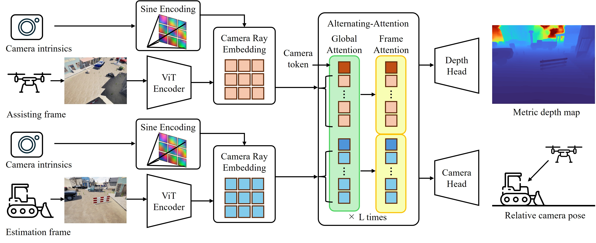

## ___***XVADER: eXternal-View Assisted Depth Estimation from RGB cameras***___

> ⚠️ *This paper is currently under double-blind review. The paper will be made publicly available upon acceptance.*

## Overview:
**XVADER** predicts dense, metrically scaled depth maps and camera poses from an estimation frame and its assisting frames using their camera intrinsics.

## Architecture

Each input image is patchified and processed into feature tokens by ViT encoder.
Camera intrinsics are embedded alongside image features to enable metric-scale estimation.
As proposed in VGGT, alternating attention allows information sharing across input images.
Finally, the depth and camera heads predict dense depth maps and camera poses in metric scale.

## Result

## Demo

under construction.
